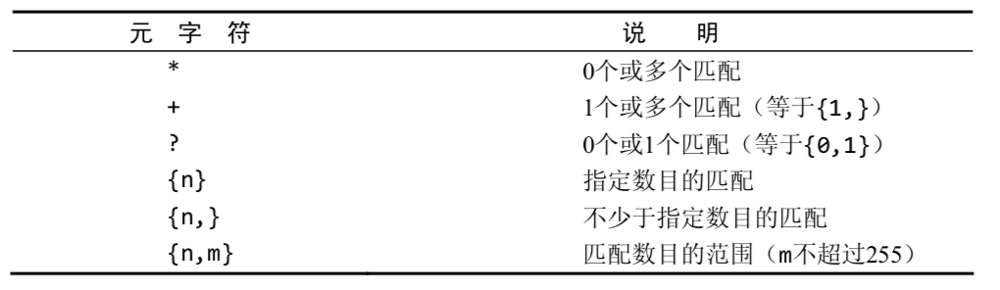

[TOC]

## MySQL Note

**sql语言**：Structured Query Language 即结构化查询语言

### 什么是数据库

数据库软件应称为DBMS(数据库管理系统)。数据库是通过DBMS创建和操纵的容器。数据库可以是保存在硬设备 上的文件，但也可以不是。在很大程度上说，数据库究竟是 文件还是别的什么东西并不重要，因为你**并不直接访问数据库**;你使用的是DBMS，它替你访问数据库。

- 表(table)
>在你将资料放入自己的文件柜时，并不是随便将它们扔进某个抽屉就完
事了，而是在文件柜中创建文件，然后将相关的资料放入特定的文件中。
在数据库领域中，这种文件称为表。表是一种结构化的文件，可用 来存储某种特定类型的数据。表可以保存顾客清单、产品目录，或者其 他信息清单。

- 列(column)
>表由列组成。列中存储着表中某部分的信息。
>理解列的最好办法是将数据库表想象为一个网格。网格中每一列存 储着一条特定的信息。例如，在顾客表中，一个列存储着顾客编号，另 一个列存储着顾客名，而地址、城市、州以及邮政编码全都存储在各自 的列中。

- 行(row)
>表中的数据是按行存储的，所保存的每个记录存储在自己的行内。如果将表想象为网格，网格中垂直的列为表列，水平行为表行。
>例如，顾客表可以每行存储一个顾客。表中的行数为记录的总数。

- 主键(primary key)
>主键一一列(或一组列)，其值能够唯一区分表中每个行。
>表中每一行都应该有可以唯一标识自己的一列(或一组列)。一个顾 客表可以使用顾客编号列，而订单表可以使用订单ID，雇员表可以使用 雇员ID或雇员社会保险号。

- 数据类型(datatype)
> 所容许的数据的类型。每个表列都有相 应的数据类型，它限制(或容许)该列中存储的数据。
>例如，如果列中存储的为数字(或许是订单中的物品数)，则 相应的数据类型应该为数值类型。如果列中存储的是日期、文本、注释、 金额等，则应该用恰当的数据类型规定出来。

### 使用MySQL

**SHOW语句**
SHOW COLUMNS FROM **(某张表);

>SHOW COLUMNS要求给出一个表名(这个例子中的FROMcustomers)，它对每个字段返回一行，行中包含字段名、数据 类型、是否允许NULL、键信息、默认值以及其他信息(如字段cust_id 的auto_increment)。

**SHOW STATUS**，用于显示广泛的服务器状态信息;
**SHOW CREATE DATABASE和SHOW CREATE TABLE**，分别用来显示创
建特定数据库或表的MySQL语句;
**SHOW GRANTS**，用来显示授予用户(所有用户或特定用户)的安全权限;
**SHOW ERRORS和SHOW WARNINGS**，用来显示服务器错误或警告消息。

###检索数据
**SELECT语句**
>使用SELECT检索表数据，必须至少给出两条信息——想选择什 么，以及从什么地方选择。

检索单个列

    SELECT pro_name FROM products;

检索多个列

     SELECT pro_name，pro_id,pro_price FROM products;
     
检索所有列

     SELECT * FROM products;
>使用通配符 一般，除非你确实需要表中的每个列，否则最 好别使用*通配符。虽然使用通配符可能会使你自己省事，不 用明确列出所需列，但检索不需要的列通常会降低检索和应 用程序的性能。

检索不同的行

    SELECT DISTINCT pro_price FROM products;

>DISTINCT关键字应用于所有列而 不仅是前置它的列。如果给出SELECT DISTINCT vend_id, prod_price，除非指定的两个列都不同，否则所有行都将被 检索出来。

限制结果

    SELECT  pro_name FROM products LIMIT 5;

>带一个值的LIMIT总是从第一行开始，给出的数为返回的行数。 带两个值的LIMIT可以指定从行号为第一个值的位置开始。

>LIMIT语法 LIMIT 3, 4的含义是从行4开始的3 行还是从行3开始的4行?如前所述，它的意思是从行3开始的4 行，这容易把人搞糊涂。

>由于这个原因，MySQL 5支持LIMIT的另一种替代语法。LIMIT 4 OFFSET 3意为从行3开始取4行，就像LIMIT 3, 4一样。

>LIMIT中指定要检索的行数为检索的最大行 数。如果没有足够的行(例如，给出LIMIT 10, 5，但只有13 行)，MySQL将只返回它能返回的那么多行。

使用完全限定的表名

    SELECT  products.pro_name FROM products;

### 排序检索数据
**ORDER BY子句**

为了明确地排序用SELECT语句检索出的数据，可使用ORDER BY子句。ORDER BY子句取一个或多个列的名字，据此对输出进行排序。

单个排序

    SELECT  pro_name FROM products ORDER BY pro_name;

多个排序

     SELECT  pro_name，pro_price,pro_id FROM products 
     ORDER BY pro_id,pro_name;

指定排序方向

默认升序排序

降序为

     SELECT  pro_name，pro_price,pro_id FROM products 
     ORDER BY pro_price DESC;
>DESC关键字只应用到直接位于其前面的列名。在上例中，只对prod_price列指定DESC，对prod_name列不指定。因此， prod_price列以降序排序，而prod_name列(在每个价格内)仍然按标准 的升序排序。

>在多个列上降序排序 如果想在多个列上进行降序排序，必须 对每个列指定DESC关键字。

### 过滤数据
**WHERE子句**

数据库表一般包含大量的数据，很少需要检索表中所有行。通常只 会根据特定操作或报告的需要提取表数据的子集。只检索所需数据需要 指定搜索条件(search criteria)，搜索条件也称为过滤条件(filter condition)。

具体匹配

    SELECT  pro_name，pro_price FROM products 
    WHERE pro_id = 5;

范围值查找（BETWEEN）

    SELECT  pro_name，pro_price FROM products 
    WHERE pro_price BETWEEN 5 and 10;

### 数据过滤
**组合WHERE 子句**

操作符(operator) 用来联结或改变WHERE子句中的子句的关键 字。也称为逻辑操作符(logical operator)。

**操作符**：and 、or 、in、not
        
    # AND
    SELECT  pro_name，pro_price FROM products 
    WHERE pro_price = 5 AND pro_price = 6;
    # OR
    SELECT  pro_name，pro_price FROM products 
    WHERE pro_price = 5 OR pro_price = 6;

>在WHERE子句中使用圆括号 
>任何时候使用具有and 和 or操作符的WHERE子句，都应该使用圆括号明确地分组操作符。不要过分依赖默认计算次序，即使它确实是你想要的东西也是如 此。使用圆括号没有什么坏处，它能消除歧义。
**SQL(像多数语言一样)在处理OR操作符前，优先处理AND操作符。**

    # IN
    SELECT  pro_name，pro_price FROM products 
    WHERE pro_price IN (5,6,7);
    # NOT
    SELECT  pro_name，pro_price FROM products 
    WHERE pro_price NOT IN (5,6,7);

### 用通配符进行过滤

通配符(wildcard) 用来匹配值的一部分的特殊字符。
搜索模式(search pattern)由字面值、通配符或两者组合构成的搜索条件。

**百分号(%)通配符**

    SELECT  pro_name，pro_price FROM products 
    WHERE pro_name LIKE 'ab%';
    # %abc%  包含abc的
    # a%b    a开头b结尾
>最常使用的通配符是百分号(%)。在搜索串中，%表示任何字符出现 任意次数。
>此例子使用了搜索模式'j%'。在执行这条子句时，将检索任意以jet起头的词。%告诉MySQL接受jet之后的任意字符，不管它有多少字符。

**下划线(_)通配符**
下划线的用途与%一样，但下划线只匹配单个字符而不是多个字符。

>MySQL的通配符很有用。但这种功能是有代价的:通配 符搜索的处理一般要比前面讨论的其他搜索所花时间更长。

### 使用正则表达式

- 正则表达式1000|2000。
’|‘ 为正则表达式的OR操作 符。它表示匹配其中之一，因此1000和2000都匹配并返回。

- []是另一种形式的OR语句。
事实上，正则表达式[123]Ton 为[1|2|3]Ton的缩写。

- 正则表达式[1-5] Ton。
[1-5]定义了一个范围，这个表达式意思是匹配1到5，

- . 点 匹配任意字符，因此每个行都被检索出来。

**空白元字符**

**字符类**

**重复元字符**

**定位元字符**

### 使用数据处理函数
大多数SQL实现支持以下类型的函数。
- 用于处理文本串(如删除或填充值，转换值为大写或小写)的文本函数。
- 用于在数值数据上进行算术操作(如返回绝对值，进行代数运算)的数值函数。
- 用于处理日期和时间值并从这些值中提取特定成分(例如，返回两个日期之差，检查日期有效性等)的日期和时间函数。
- 返回DBMS正使用的特殊信息(如返回用户登录信息，检查版本细节)的系统函数。
**常用的文本处理函数**

**日期和时间处理函数**

    # ju
    SELECT pro_id,pro_price FROM products 
    WHERE pro_data = '2018-01-01'
    # Date
    SELECT pro_id,pro_price FROM products 
    WHERE Date（pro_data） = '2018-01-01'

**数值处理函数**

    
#### 汇总数据
**聚集函数**

    SELECT COUNT(*) AS num_items,
    MIN(pro_price) AS price_min,
    MAX(pro_price) AS price_max,
    AVG(pro_price) AS price_avg FROM products;

#### 分组数据
**GROUP BY子句和HAVING子句**

**创建分组**

    SELECT COUNT(*) FROM products
    GROUP BY price;

**过滤分组**

    SELECT COUNT(*) FROM products
    GROUP BY price
    HAVING COUNT(*) >=2;
>HAVING和WHERE的差别 这里有另一种理解方法，WHERE在数据 分组前进行过滤，HAVING在数据分组后进行过滤。这是一个重要的区别，WHERE排除的行不包括在分组中。这可能会改变计 算值，从而影响HAVING子句中基于这些值过滤掉的分组。

**分组和排序**
虽然GROUP BY和ORDER BY经常完成相同的工作，但它们是非常不同
的。

### 使用子查询

    SELECT pro_id FROM products
    WEHRE price IN （
	    SELECT price FROM products2
	    WHERE pro_id = 2
	    ）;

> 逐渐增加子查询来建立查询
> 用子查询测试和调试查询很有 技巧性，特别是在这些语句的复杂性不断增加的情况下更是如 此。用子查询建立(和测试)查询的最可靠的方法是逐渐进行， 这与MySQL处理它们的方法非常相同。首先，建立和测试最 内层的查询。然后，用硬编码数据建立和测试外层查询，并且仅在确认它正常后才嵌入子查询。这时，再次测试它。对于要 增加的每个查询，重复这些步骤。这样做仅给构造查询增加了 一点点时间，但节省了以后(找出查询为什么不正常)的大量 时间，并且极大地提高了查询一开始就正常工作的可能性。

### 联接表
SQL最强大的功能之一就是能在数据检索查询的执行中联结(join) 表。

>外键(foreign key) 外键为某个表中的一列，它包含另一个表 的主键值，定义了两个表之间的关系。
>可伸缩性(scale) 能够适应不断增加的工作量而不失败。设 计良好的数据库或应用程序称之为可伸缩性好(scale well)。

    SELECT vend_name,prod_name,prod_price FROM vendors,productts
    WHERE vendor.vend_id = products.pro_id;

联结多个表
SQL对一条SELECT语句中可以联结的表的数目没有限制。创建联结
的基本规则也相同。首先列出所有表，然后定义表之间的关系。

>性能考虑
>MySQL在运行时关联指定的每个表以处理联结。 这种处理可能是非常耗费资源的，因此应该仔细，不要联结 不必要的表。联结的表越多，性能下降越厉害。

###创建高级联结

**自联结**
假如你发现某物品(其ID为DTNTR)存在问题，因此想知道生产该物品的供应商生产的其他物品是否也存在这些问题。此查询要求首先找到生产ID为DTNTR的物品的供应商，然后找出这个供应商生产的其他物品。

    SELECT p1.prod_id,p1.prod_name FROM products AS p1,products AS ps
    WHERE p1.vend_id =p2.vend_id
    AND p2.prod_id = 'DTNTR';
>自联结通常作为外部语句用来替代 从相同表中检索数据时使用的子查询语句。虽然最终的结果是 相同的，但有时候处理联结远比处理子查询快得多。

**自然联结**

无论何时对表进行联结，应该至少有一个列出现在不止一个表中(被 联结的列)。标准的联结(\内部联结)返回所有数据，甚至相同的列多次出现。自然联结排除多次出现，使每个列只返回一次。

**外部联结**
许多联结将一个表中的行与另一个表中的行相关联。但有时候会需要包含没有关联行的那些行。

    SELECT customers.cust_id，order_mum FROM customers 
    INNER JOIN orders ON customer.cust_id = orders.cust_id;

>关键字OUTER JOIN、INNER JOIN来指定联结的类型
>在使用OUTER JOIN语法时，必须使用RIGHT或LEFT关键字 指定包括其所有行的表(RIGHT指出的是OUTER JOIN右边的表，而LEFT 指出的是OUTER JOIN左边的表)。

### 组合查询
多数SQL查询都只包含从一个或多个表中返回数据的单条SELECT语 句。MySQL也允许执行多个查询(多条SELECT语句)，并将结果作为单个 查询结果集返回。这些组合查询通常称为并(union)或复合查询(compound query)。
>有两种基本情况，其中需要使用组合查询:
>- 在单个查询中从不同的表返回类似结构的数据; 
>- 对单个表执行多个查询，按单个查询返回数据。

    SELECT ven_id，prod_id，prod_price FROM products
    WHERE products <=5
    UNION
    SELECT vend_id，prod_id，prod_price FROM products
    WHERE vend_id IN（1001，1002）

**UNION规则**
>- UNION必须由两条或两条以上的SELECT语句组成，语句之间用关键字UNION分隔(因此，如果组合4条SELECT语句，将要使用3个 UNION关键字)。
>- UNION中的每个查询必须包含相同的列、表达式或聚集函数(不过各个列不需要以相同的次序列出)。
>- 列数据类型必须兼容:类型不必完全相同，但必须是DBMS可以隐含地转换的类型(例如，不同的数值类型或不同的日期类型)。

注意
>SELECT语句的输出用ORDER BY子句排序。在用UNION组合查询时，只 能使用一条ORDER BY子句，它必须出现在最后一条SELECT语句之后。

### 插入数据
INSERT语法

    INSERT INTO customers（
    cust_name,
    cust_city）
    VALUES(
    'XXXX',
    'BeiJing')
    # 可以直接插入对应值

### 更新和删除数据
UPDATE和DELETE语句
>- 更新和删除表中特定行; 
>- 更新和删除表中所有行。

    UPDATA customers SET cus_name = 'abc'
    WHERE cust_id = 5;
    # 设置 为NULL 删去数据变为空值

    DELETE FROM customers
    WHERE cust_id = 5;

**注意**
>下面是许多SQL程序员使用UPDATE或DELETE时所遵循的习惯
>- 除非确实打算更新和删除每一行，否则绝对不要使用不带WHERE 子句的UPDATE或DELETE语句。
>- 保证每个表都有主键，尽可能 像WHERE子句那样使用它(可以指定各主键、多个值或值的范围)。 
>- 在对UPDATE或DELETE语句使用WHERE子句前，应该先用SELECT进行测试，保证它过滤的是正确的记录，以防编写的WHERE子句不正确。
>- 使用强制实施引用完整性的数据库，这样MySQL将不允许删除具有与其他表相关联的数据的行。

